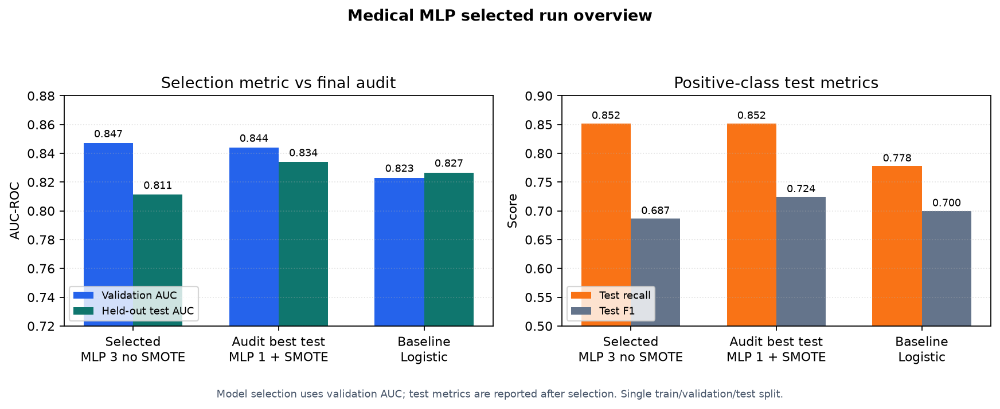

# Medical MLP Classification

[](https://github.com/NAMEisNOTvailable/mlp-medical-classification/actions/workflows/smoke.yml)


This project explores diabetes classification on the scaled Pima Indians
Diabetes dataset. It compares logistic regression with multilayer perceptrons
of different depths, then measures how SMOTE changes recall, F1, and AUC-ROC
for the diabetes-positive class.

## Project Snapshot

| Area | Summary |
| --- | --- |
| Task | Diabetes-positive classification |
| Dataset | LIBSVM `diabetes_scale`, 768 rows, 8 scaled features |
| Positive target | Raw LIBSVM label `-1` mapped to `diabetes_positive=1` |
| Models | Logistic regression baseline; MLPs with 1, 3, 7, and 12 hidden layers |
| Imbalance handling | SMOTE on the training split |
| Model selection | Validation AUC-ROC; test metrics held out for final reporting |
| Thresholding | Per-model threshold selected on validation F1 |
| Single-split selected model | MLP 3 hidden layers without SMOTE; validation AUC-ROC 0.8471, test AUC-ROC 0.8113 |
| Python | 3.10 or 3.11; `.python-version` pins 3.11.9 for local reproduction |
| Main artifacts | [`notebooks/medical_mlp_classification.ipynb`](notebooks/medical_mlp_classification.ipynb), [`src/medical_mlp_classification`](src/medical_mlp_classification), [`results`](results) |
| Main command | `python scripts/run_experiment.py` or `medical-mlp-classification` |



## Method

The experiment loads the LIBSVM dataset with sparse feature indices preserved,
maps the minority diabetes class to the positive target, and uses stratified
train, validation, and test splits. Feature scaling is fitted on the training
split, and SMOTE is applied only to training data. The downloaded data file is
checked against a pinned SHA-256 digest before use.

The model comparison includes logistic regression as a baseline and four MLP
depths: 1, 3, 7, and 12 hidden layers. Each model's decision threshold is chosen
on validation F1, models are ranked by validation AUC-ROC, and the held-out test
split is used for final metrics only. Each row reports accuracy, AUC-ROC,
positive-class precision, positive-class recall, F1, specificity, and
confusion-matrix counts.

## Results

These results were generated with `python scripts/run_experiment.py`.

| Model | Sampling | Validation AUC | Threshold | Test AUC | Test recall | Test F1 |
| --- | --- | ---: | ---: | ---: | ---: | ---: |
| MLP 3 hidden layers | No SMOTE | 0.8471 | 0.3079 | 0.8113 | 0.8519 | 0.6866 |
| MLP 1 hidden layer | SMOTE | 0.8440 | 0.4546 | 0.8339 | 0.8519 | 0.7244 |
| MLP 1 hidden layer | No SMOTE | 0.8378 | 0.3218 | 0.8263 | 0.7593 | 0.6777 |
| MLP 7 hidden layers | No SMOTE | 0.8298 | 0.3517 | 0.7857 | 0.6852 | 0.6325 |
| Logistic Regression | SMOTE | 0.8281 | 0.5153 | 0.8230 | 0.6667 | 0.6316 |
| MLP 7 hidden layers | SMOTE | 0.8248 | 0.5883 | 0.8074 | 0.6111 | 0.6000 |
| MLP 3 hidden layers | SMOTE | 0.8245 | 0.5081 | 0.7917 | 0.6481 | 0.6034 |
| Logistic Regression | No SMOTE | 0.8231 | 0.3281 | 0.8267 | 0.7778 | 0.7000 |
| MLP 12 hidden layers | SMOTE | 0.8142 | 0.2347 | 0.7615 | 0.8704 | 0.6438 |
| MLP 12 hidden layers | No SMOTE | 0.8142 | 0.3754 | 0.7800 | 0.6481 | 0.6034 |

Full metrics are stored in [`results/model_comparison.csv`](results/model_comparison.csv).
Run metadata is stored in [`results/summary.json`](results/summary.json).
ROC and precision-recall plots are stored in [`results/`](results/).

The single-split selected run is the 3-hidden-layer MLP without SMOTE because it
has the highest validation AUC-ROC for this train/validation/test split. For
audit, the 1-hidden-layer MLP with SMOTE has the highest held-out test AUC-ROC
in this run; model selection is still based on validation results. Logistic
regression remains close, which is expected for a small tabular dataset with
only eight features.

## Project Notes

| What to inspect | Where |
| --- | --- |
| Executed notebook report view | [`notebooks/medical_mlp_classification.ipynb`](notebooks/medical_mlp_classification.ipynb) |
| Reusable experiment workflow | [`src/medical_mlp_classification/experiment.py`](src/medical_mlp_classification/experiment.py) |
| Validation-selected metrics and run metadata | [`results/model_comparison.csv`](results/model_comparison.csv), [`results/summary.json`](results/summary.json) |
| Result plots | [`results/auc_comparison.png`](results/auc_comparison.png), [`results/roc_curves.png`](results/roc_curves.png), [`results/precision_recall_curves.png`](results/precision_recall_curves.png) |
| Reproducibility checks | [`tests`](tests), [`.github/workflows/smoke.yml`](.github/workflows/smoke.yml) |

## Reproduce

Use Python 3.10 or 3.11. The committed `.python-version` records Python 3.11.9,
which is the local Windows CPU environment used to verify the committed result
set.

Install the package and development test dependency in editable mode:

```bash
python -m venv .venv
.\.venv\Scripts\python -m pip install --upgrade pip
.\.venv\Scripts\python -m pip install -e ".[dev]"
```

`requirements.txt` is kept as a compatibility wrapper for the same editable
development install:

```bash
.\.venv\Scripts\python -m pip install -r requirements.txt
```

For the exact Windows CPU environment used to verify the committed results, use
the lock file, then install the local package without reinstalling dependencies:

```bash
.\.venv\Scripts\python -m pip install -r requirements-lock.txt
.\.venv\Scripts\python -m pip install -e . --no-deps
```

If Windows reports a TensorFlow long-path installation error, create the virtual
environment in a shorter path:

```bash
python -m venv C:\venvs\mlp-medical
C:\venvs\mlp-medical\Scripts\python.exe -m pip install -r requirements.txt
```

Run a short CPU check:

```bash
python scripts/run_experiment.py --quick --no-plots --output-dir results/smoke
```

Run the full experiment:

```bash
python scripts/run_experiment.py
```

The editable install also exposes a console command:

```bash
medical-mlp-classification
```

To force a fixed threshold instead of validation-threshold selection:

```bash
python scripts/run_experiment.py --threshold 0.5
```

Regenerate the README result chart:

```bash
python scripts/generate_result_assets.py
```

## Repository Structure

```text
assets/                       Generated README display chart
data/                         Data source note; downloaded raw data is ignored
docs/                         Experiment notes
notebooks/                    Notebook-facing report entry point
pyproject.toml                Package metadata and dependency ranges
results/                      Reproduced metrics and plots
scripts/                      CLI and result-asset generation scripts
src/medical_mlp_classification/
                              Reusable experiment code
tests/                        Data-loading regression tests
```

## Notebook

The notebook is a compact report view for the generated results. Install the
optional notebook dependencies only when opening it interactively:

```bash
python -m pip install -e ".[notebook]"
jupyter notebook notebooks/medical_mlp_classification.ipynb
```

## Background

This project keeps the original comparison of MLP depths and SMOTE, while using
a reproducible script-based workflow and the LIBSVM label mapping documented in
the dataset notes.

## Limitations

This is a small academic experiment on a demographically narrow public dataset.
The value of this project is the preprocessing, class-imbalance handling,
model comparison, validation-based selection, and evaluation workflow.

## License and Data

Original project code and documentation are licensed under the MIT License. The
Pima diabetes dataset is external to this repository; follow the source dataset
terms when downloading or reusing it.
